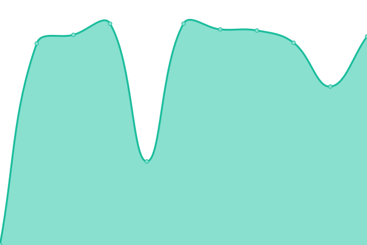
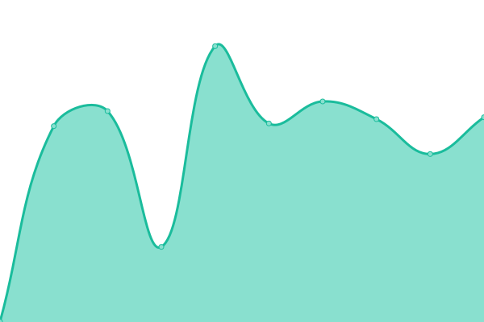

# [📈 Live Status](https://thititongumpun.github.io/uptime): <!--live status--> **🟩 All systems operational**

This repository contains the open-source uptime monitor and status page for [thititongumpun](thiti.wcydtt.co), powered by [Upptime](https://github.com/upptime/upptime).

With [Upptime](https://upptime.js.org), you can get your own unlimited and free uptime monitor and status page, powered entirely by a GitHub repository. We use [Issues](https://github.com/thititongumpun/uptime/issues) as incident reports, [Actions](https://github.com/thititongumpun/uptime/actions) as uptime monitors, and [Pages](https://thititongumpun.github.io/uptime) for the status page.

<!--start: status pages-->
<!-- This summary is generated by Upptime (https://github.com/upptime/upptime) -->
<!-- Do not edit this manually, your changes will be overwritten -->
<!-- prettier-ignore -->
| URL | Status | History | Response Time | Uptime |
| --- | ------ | ------- | ------------- | ------ |
|  [MyTimesheetMemo](https://pwa.wcydtt.co) | 🟩 Up | [my-timesheet-memo.yml](https://github.com/thititongumpun/uptime/commits/HEAD/history/my-timesheet-memo.yml) | 

 303ms
     
 | 

<a href="https://uptime.wcydtt.co/history/my-timesheet-memo">100.00%</a>
    

|  [SonarQube](https://sonar.wcydtt.co) | 🟩 Up | [sonar-qube.yml](https://github.com/thititongumpun/uptime/commits/HEAD/history/sonar-qube.yml) | 

 708ms
     
 | 

<a href="https://uptime.wcydtt.co/history/sonar-qube">100.00%</a>
    

|  [Jenkins](https://jenkins.wcydtt.co/login) | 🟩 Up | [jenkins.yml](https://github.com/thititongumpun/uptime/commits/HEAD/history/jenkins.yml) | 

 688ms
     
 | 

<a href="https://uptime.wcydtt.co/history/jenkins">66.46%</a>
    

|  [Gitlab](https://gitlab.wcydtt.co) | 🟩 Up | [gitlab.yml](https://github.com/thititongumpun/uptime/commits/HEAD/history/gitlab.yml) | 

 1131ms
     
 | 

<a href="https://uptime.wcydtt.co/history/gitlab">66.47%</a>
    

|  [Jenkins Dev](https://jenkins-dev.wcydtt.co/login) | 🟩 Up | [jenkins-dev.yml](https://github.com/thititongumpun/uptime/commits/HEAD/history/jenkins-dev.yml) | 

 736ms
     
 | 

<a href="https://uptime.wcydtt.co/history/jenkins-dev">100.00%</a>
    

<!--end: status pages-->

[**Visit our status website →**](https://thititongumpun.github.io/uptime)

## 📄 License

- Powered by: [Upptime](https://github.com/upptime/upptime)
- Code: [MIT](./LICENSE) © [Anand Chowdhary](https://anandchowdhary.com), supported by [Pabio](https://pabio.com)
- Data in the `./history` directory: [Open Database License](https://opendatacommons.org/licenses/odbl/1-0/)
